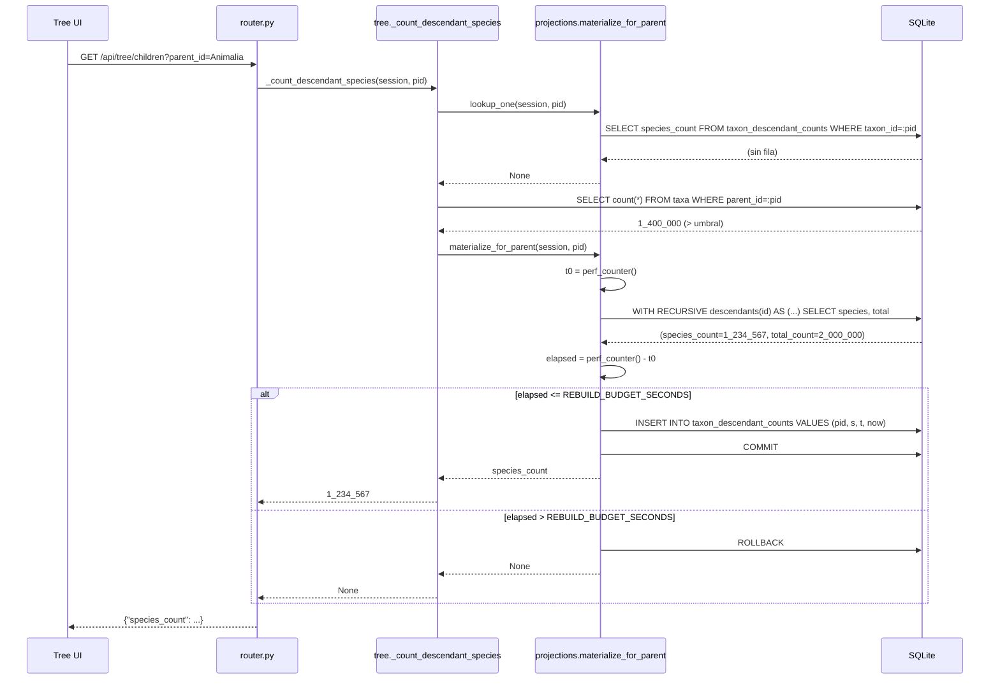

# Diseño: descendant-counts-projection

## Enfoque técnico

Se agrega una tabla persistente `taxon_descendant_counts` que cachea
`(species_count, total_count)` exactamente para los padres cuyo
`direct_children_count` supera `SPECIES_COUNT_LAZY_NULL_THRESHOLD`
(`taxon/api/tree.py:70`, 1M). Hoy esos padres cortocircuitan a `None`
en `taxon/api/tree.py:198-201` (guarda por conteo directo) y en
`taxon/api/tree.py:236-239` (guarda por conteo total), por lo que
`Animalia`, `Eukaryota` y `Methanobacteriota` muestran `?` de forma
permanente.

La forma del cambio es una única porción de backend: una clase ORM en
`taxon/schema.py`, un nuevo módulo `taxon/api/projections.py` que posee
tanto el worker de reconstrucción como los helpers de lectura, dos
ediciones en los puntos de llamada de la ruta de lectura
(`_count_descendant_species`, `_batch_species_counts`), un subcomando
de `migrate` y un hook posterior en `import_data`. La ruta de lectura
gana una verificación previa de caché; ante un fallo de caché ejecuta
el mismo CTE recursivo que ejecuta hoy, mide el recorrido y luego
confirma la fila o vuelve al comportamiento lazy-null existente. Todo
permanece sobre la `Session` síncrona que los helpers actuales ya
reciben: sin hilos, sin async, sin worker en segundo plano.

El módulo se llama `projections.py` y no `_projection.py` como decía la
propuesta: expone una superficie destinada a la CLI y a importaciones
externas (`materialize_all` es invocado por `taxon/migrate.py` y
`taxon/import_data.py`, ambos fuera de `taxon/api/`), de modo que la
convención de guion bajo privado usada en `_tree_tiers.py` no aplica.
Esto es ADR-1.

## Decisiones de arquitectura

| Decisión | Elección | Compensación | Fundamento de la decisión |
| --- | --- | --- | --- |
| Nombre y ubicación del módulo | `taxon/api/projections.py` (público, sin guion bajo inicial) | Rompe con la nomenclatura `_tree_tiers.py` / `_projection.py` de la propuesta | `materialize_all` es importado por `taxon/migrate.py` y `taxon/import_data.py`, que están fuera de `taxon/api/`. Un guion bajo inicial indica privado al paquete; esta superficie no lo es. Ver ADR-1. |
| Ubicación de la clase ORM | `TaxonDescendantCount` en `taxon/schema.py`, junto a `Taxon` (`taxon/schema.py:20`) y `SpeciesPath` (`taxon/schema.py:41`) | `taxon/api/workspace.py` también declara modelos sobre la misma `Base` | La proyección es una tabla derivada de la taxonomía, no una tabla de workspace. Los modelos de `workspace.py` se identifican por `(genus, epithet)` y sobreviven a las reimportaciones por diseño (`taxon/api/workspace.py:18-21`); esta tabla tiene FK a `taxa.id` y una reimportación la invalida. Corresponde junto a `SpeciesPath`, que comparte su ciclo de vida. |
| Ciclo de vida de la tabla | `Base.metadata.create_all` (sin Alembic), igual que `SpeciesPath` | `migrate.py:_run_apply` filtra por `WORKSPACE_TABLES` (`taxon/migrate.py:236-243`), por lo que la tabla NO se crea con un `apply` simple salvo que se amplíe esa tupla | Se amplía el filtro con una nueva tupla `PROJECTION_TABLES` en lugar de introducir el nombre en `WORKSPACE_TABLES`: el docstring en `taxon/api/workspace.py:43-50` fija el significado de esa tupla y `test_apply_creates_three_new_tables` verifica su tamaño. Ver "Migración / Despliegue". |
| Modelo de concurrencia | Síncrono, sobre la `Session` del llamador | La primera petición para un padre sin caché paga la latencia de reconstrucción en línea | Todos los helpers actuales reciben `Session` (`taxon/api/tree.py:156`, `taxon/api/_tree_tiers.py:407`). Introducir un hilo o una cola de tareas requeriría un segundo engine, un segundo registro de `taxonomy_display_level` y cableado en el lifespan. La guarda de SLO descrita abajo acota el costo en línea. |
| Medición del SLO | Medir el tiempo de reloj transcurrido con `time.perf_counter()` **alrededor del CTE ya emitido** y luego decidir si confirmar o revertir | Se paga el costo completo del CTE incluso cuando después se descarta el resultado | No se puede predecir el costo sin recorrer. Pero el recorrido es el mismo que el código previo al cambio estaba dispuesto a ejecutar para padres bajo el umbral, y la rama de descarte devuelve exactamente la respuesta previa al cambio (`None`). Medir después es honesto; predecir antes es una conjetura. Ver ADR-2. |
| Precedencia del acierto de caché | La fila cacheada gana sobre ambas guardas de umbral y sobre cualquier valor del CTE | Una fila obsoleta puede sobrevivir a una mutación de `taxa` que no pasó por `import_data` | Fijado por la especificación (`Cached stale row wins over CTE`). `computed_at` hace observable la obsolescencia y `apply-projection` es la reparación documentada. |
| Estrategia de fusión en lote | Precargar las filas cacheadas con un único `SELECT` con lista `IN`, quitar esos ids de la lista semilla y dejar intacto el CTE único existente | Un viaje de ida y vuelta adicional por lote | Mantiene intacto el contrato de CTE único: la forma de la unión semilla en `taxon/api/_tree_tiers.py:467` no cambia, sólo recibe una lista `eligible` más corta. Sin reescritura de SQL, sin joins nuevos. |

### ADR-1: `projections.py` posee tanto el worker como los helpers de lectura

**Elección**: un único módulo, `taxon/api/projections.py`, que exporta
`materialize_for_parent`, `materialize_all`, `lookup_one` y
`lookup_many`.

**Alternativas consideradas**: (a) separar las lecturas dentro de
`taxon/api/tree.py` y las escrituras en un `taxon/projection_worker.py`;
(b) colocar todo como métodos de clase sobre la clase ORM.

**Fundamento**: los helpers de lectura y el worker de escritura
comparten el predicado de población (`direct_children_count > threshold`)
y la importación de la constante de umbral. Separarlos coloca ese
predicado en dos archivos y reabre el riesgo de divergencia que la
especificación nombra explícitamente. La opción (b) colocaría CTEs en
texto SQL sobre un modelo declarativo, algo que ningún otro modelo de
`taxon/schema.py` hace.

### ADR-2: el presupuesto de SLO se mide, no se predice

**Elección**: `materialize_for_parent` ejecuta el CTE, mide el tiempo
transcurrido con `time.perf_counter()` y confirma únicamente cuando
`elapsed <= REBUILD_BUDGET_SECONDS`. Si excede el presupuesto ejecuta
`session.rollback()` y retorna sin escribir.

**Alternativas consideradas**: (a) predecir el costo a partir de
`direct_children_count` antes de recorrer; (b) usar un
`progress_handler` de SQLite o una interrupción de sentencia para
abortar el CTE a mitad del recorrido; (c) no imponer presupuesto
alguno.

**Fundamento**: (a) es exactamente la heurística que ya falló:
`taxon/api/tree.py:58-66` documenta que `Eukaryota` tiene 9 hijos
directos y un subárbol de 5,6M de filas, de modo que la amplitud no
predice el costo. (b) requiere un handler a nivel de conexión que se
dispararía dentro de consultas no relacionadas sobre la conexión SQLite
compartida y puede dejar la sesión en un estado parcialmente abortado.
(c) viola el requisito de SLO de la especificación. Medir después del
recorrido implica que la *primera* petición para un padre que excede el
presupuesto igual paga el costo completo una vez, pero devuelve la
respuesta previa al cambio (`None`) y, como se omite la escritura, la
siguiente petición reintenta. Ese comportamiento de reintento es
precisamente lo que fija el escenario `Rebuild over budget skips the
write` de la especificación.

## Flujo de datos

```
    Router                _count_descendant_species        projections.py            SQLite
    ------                -------------------------        --------------            ------
  GET /api/tree/children ─► ¿acierto en _cache? ──sí──► retornar
                            │ no
                            ▼
                            lookup_one(session, pid) ────►  SELECT species_count
                            │                               FROM taxon_descendant_counts
                            │◄──────── acierto ─────────────  WHERE taxon_id = :pid
                            │                                        │
                            │  (acierto) retornar species_count ─────┘  [sin guarda de umbral, sin CTE]
                            ▼ (fallo)
                            ¿direct_count > threshold? ──no──► ruta CTE existente (sin cambios)
                            │ sí
                            ▼
                            materialize_for_parent ──────►  perf_counter() inicio
                                                            CTE recursivo (species + total)
                                                            perf_counter() fin
                                                            ├─ dentro del presupuesto → INSERT fila, commit
                                                            └─ fuera del presupuesto  → rollback, sin fila
                            │
                            ▼
                            retornar species_count | None
```

### Secuencia de la primera lectura (caché fría, dentro del presupuesto)



## Cambios de archivos

| Archivo | Acción | Descripción |
| --- | --- | --- |
| `taxon/schema.py` | Modificar | Agregar `TaxonDescendantCount(Base)` después de `SpeciesPath` (`taxon/schema.py:41-56`). Cuatro columnas, `taxon_id` PK + FK a `taxa.id`. ~18 LOC. |
| `taxon/api/projections.py` | Crear | Módulo nuevo. `REBUILD_BUDGET_SECONDS`, `PROJECTION_TABLES`, `materialize_for_parent`, `materialize_all`, `lookup_one`, `lookup_many`, `_projected_parent_ids`, `_table_exists`. ~180 LOC. |
| `taxon/api/tree.py` | Modificar | `_count_descendant_species` (`taxon/api/tree.py:155-242`): insertar `lookup_one` antes de la guarda de conteo directo en la línea 196; en la rama de umbral de las líneas 198-201 y en la de conteo total de las líneas 236-239, invocar `materialize_for_parent`. ~25 LOC netas. |
| `taxon/api/_tree_tiers.py` | Modificar | `_batch_species_counts` (`taxon/api/_tree_tiers.py:406-488`): insertar `lookup_many` después de la lectura de `direct_counts` en la línea 446; sembrar el diccionario `result` con los valores cacheados y excluir esos ids de `eligible` (líneas 448-455). El CTE de las líneas 467-485 no se toca. ~15 LOC netas. |
| `taxon/migrate.py` | Modificar | Agregar el subparser `apply-projection` con `--threshold`; agregar `PROJECTION_TABLES` al conjunto de tablas de `_run_apply` para que el `apply` simple cree la tabla; registrar `taxonomy_display_level` en el engine de la CLI (`taxon/migrate.py:233`). ~45 LOC. |
| `taxon/import_data.py` | Modificar | Invocar `materialize_all` después de `_populate_species_paths(engine)` (`taxon/import_data.py:71`), antes del `return counts`. El engine de `taxon/import_data.py:75-84` ya tiene un listener `connect`: agregar allí el registro de `taxonomy_display_level`. ~15 LOC. |
| `taxon/tests/test_descendant_counts_projection.py` | Crear | Pruebas RED-first para esquema, acierto/fallo de caché, fallback de SLO, idempotencia, fusión en lote y BD heredada. 14 pruebas, ~380 LOC. |
| `taxon/tests/test_migrate.py` | Modificar | Agregar pruebas de CLI para `apply-projection`; actualizar `test_apply_creates_three_new_tables` para el conjunto de tablas ampliado. ~60 LOC. |
| `openspec/changes/descendant-counts-projection/design.md` | Crear | Este documento. |
| `documents-es/openspec/descendant-counts-projection/design-es.md` | Crear | Espejo en español (traducción fiel, registro neutro/profesional) según AGENTS.md §1. |

## Interfaces / Contratos

### DDL

```sql
CREATE TABLE taxon_descendant_counts (
    taxon_id      INTEGER  NOT NULL PRIMARY KEY REFERENCES taxa (id),
    species_count INTEGER  NOT NULL,
    total_count   INTEGER  NOT NULL,
    computed_at   VARCHAR  NOT NULL
);
```

Sin índice secundario: `taxon_id` es la PRIMARY KEY, que SQLite respalda
con el árbol B de rowid, y toda vía de acceso es o bien una búsqueda
puntual por PK o bien una lista `IN` sobre PKs. La población está
acotada por la cantidad de padres que superan el umbral (3 en el
conjunto de datos actual de CoL).

`computed_at` se almacena como cadena ISO-8601, siguiendo la convención
de `SpeciesExplored.explored_at` en `taxon/api/workspace.py:67-71`
(`String` + `datetime.now(UTC).isoformat(timespec="seconds")`) y no como
un `TIMESTAMP` nativo: SQLite carece de tipo timestamp y el resto del
código ya se normalizó sobre cadenas ISO.

### Clase ORM — `taxon/schema.py`

```python
class TaxonDescendantCount(Base):
    """Cached (species_count, total_count) for a threshold-exceeding parent.

    Unlike the workspace tables in :mod:`taxon.api.workspace`, this row
    is keyed by ``taxa.id`` and is therefore invalidated by a re-import;
    :func:`taxon.api.projections.materialize_all` rebuilds it as the last
    step of ``taxon.import_data``.
    """

    __tablename__ = "taxon_descendant_counts"

    taxon_id: Mapped[int] = mapped_column(ForeignKey("taxa.id"), primary_key=True)
    species_count: Mapped[int] = mapped_column(Integer, nullable=False)
    total_count: Mapped[int] = mapped_column(Integer, nullable=False)
    computed_at: Mapped[str] = mapped_column(
        String,
        nullable=False,
        default=lambda: datetime.now(UTC).isoformat(timespec="seconds"),
    )
```

### Superficie del módulo — `taxon/api/projections.py`

```python
from taxon.api.tree import SPECIES_COUNT_LAZY_NULL_THRESHOLD, SPECIES_DISPLAY_LEVEL

PROJECTION_TABLES: tuple[str, ...] = ("taxon_descendant_counts",)

REBUILD_BUDGET_SECONDS: Final[float] = 1.0
"""Per-request rebuild budget. Matches the 1s /api/tree/children SLO
documented at taxon/api/tree.py:67-69."""


def lookup_one(session: Session, taxon_id: int) -> int | None:
    """Return the cached ``species_count`` or ``None`` on a miss.

    Returns ``None`` both when the row is absent AND when the table
    itself is absent (legacy DB) — the caller cannot distinguish, and
    does not need to: both fall through to the pre-change path.
    """


def lookup_many(session: Session, taxon_ids: list[int]) -> dict[int, int]:
    """Return ``{taxon_id: species_count}`` for the cached subset.

    Absent ids are simply missing from the dict. One ``IN``-list
    SELECT; empty input returns ``{}`` without a round trip.
    """


def materialize_for_parent(
    session: Session,
    parent_id: int,
    *,
    budget_seconds: float = REBUILD_BUDGET_SECONDS,
) -> int | None:
    """Rebuild and persist the row for ``parent_id``; return species_count.

    Runs the same recursive CTE as
    :func:`taxon.api.tree._count_descendant_species`, measures the
    elapsed wall-clock, and commits the row only when the walk finished
    within ``budget_seconds``. Over budget → ``session.rollback()`` and
    ``None`` (the pre-change answer), no row written.

    Idempotent: an existing row is overwritten in place (upsert on the
    primary key), so re-running never duplicates or accumulates rows.
    """


def materialize_all(
    session: Session,
    threshold: int = SPECIES_COUNT_LAZY_NULL_THRESHOLD,
    *,
    budget_seconds: float | None = None,
) -> int:
    """Rebuild every threshold-exceeding parent; return rows written.

    Iterates :func:`_projected_parent_ids` and calls
    :func:`materialize_for_parent` per parent. ``budget_seconds=None``
    (the default for the offline callers — ``migrate apply-projection``
    and ``import_data``) disables the SLO guard: those callers are not
    serving a request and MUST complete the population.
    """


def _projected_parent_ids(session: Session, threshold: int) -> list[int]:
    """Return ids whose direct-children count exceeds ``threshold``.

    ``SELECT parent_id FROM taxa WHERE parent_id IS NOT NULL
       GROUP BY parent_id HAVING count(*) > :threshold``
    """
```

La salida `budget_seconds=None` en `materialize_all` es la única
asimetría que merece señalarse: la ruta de petición debe respetar el
SLO, pero `apply-projection` e `import_data` son llamadores por lotes
fuera de línea y de otro modo se negarían a poblar exactamente los
padres para los que existe la tabla. El requisito de SLO de la
especificación está acotado a "the tree endpoint meets its per-request
SLO"; no restringe la CLI.

### Integración de la ruta de lectura — `taxon/api/tree.py`

`_count_descendant_species` (`taxon/api/tree.py:155`) gana una
verificación previa de caché y dos ganchos de reconstrucción. El
diccionario `_cache` de alcance de petición de las líneas 189-190 sigue
siendo la primera verificación (es más barata que una consulta) y la
búsqueda de la fila cacheada se inserta inmediatamente después:

```python
    if _cache is not None and parent_id in _cache:      # línea 189, sin cambios
        return _cache[parent_id]

    cached = lookup_one(session, parent_id)             # NUEVO
    if cached is not None:
        if _cache is not None:
            _cache[parent_id] = cached
        return cached                                   # sin guarda de umbral, sin CTE

    direct_count = ...                                  # líneas 196-197, sin cambios
    if direct_count > threshold:                        # línea 198
        rebuilt = materialize_for_parent(session, parent_id)   # NUEVO
        if _cache is not None:
            _cache[parent_id] = rebuilt
        return rebuilt                                  # None cuando excede el presupuesto
```

La segunda guarda de las líneas 236-239 (`total_count > threshold`)
recibe el mismo tratamiento, salvo que en ese punto el CTE *ya se
ejecutó*: en lugar de invocar `materialize_for_parent` (que volvería a
recorrer), escribe el `(species_count, total_count)` que ya tiene en
mano a través de un helper `_persist`, sujeto a la misma verificación
de presupuesto sobre el tiempo transcurrido de ese recorrido.

### Integración en lote — `taxon/api/_tree_tiers.py`

`_batch_species_counts` conserva su contrato de CTE único. El único
cambio es que `eligible` se acorta:

```python
    direct_counts = {...}                               # líneas 444-446, sin cambios

    cached = lookup_many(session, parent_ids)           # NUEVO — un SELECT con lista IN

    result: dict[int, int | None] = {}
    eligible: list[int] = []
    for pid in parent_ids:                              # línea 450
        if pid in cached:                               # NUEVO — la caché gana
            result[pid] = cached[pid]
            continue                                    # excluido de la semilla del CTE
        if direct_counts.get(pid, 0) > threshold:
            result[pid] = None
        else:
            eligible.append(pid)
            result[pid] = None
```

La unión semilla de la línea 467 (`SELECT {pid} AS root_id, {pid} AS id`)
se construye a partir de `eligible`, por lo que un padre cacheado no
aporta fila semilla y el CTE nunca lo recorre. La guarda
`if not eligible: return result` de las líneas 457-458 ya maneja
correctamente el caso en que todo está cacheado. El bucle de agregación
de las líneas 486-487 sólo escribe sobre ids que fueron sembrados, de
modo que no puede sobrescribir un valor cacheado, que es exactamente el
escenario `Cached stale row wins over CTE`, satisfecho de forma
estructural y no por una convención de orden.

Nótese la asimetría preexistente de umbral: `_batch_species_counts`
usa por defecto `threshold: int = 100_000`
(`taxon/api/_tree_tiers.py:410`) mientras que
`_count_descendant_species` usa por defecto
`SPECIES_COUNT_LAZY_NULL_THRESHOLD` = 1_000_000
(`taxon/api/tree.py:159`). Este diseño **no** modifica ese valor por
defecto —un cambio de umbral está fuera de alcance según la
especificación— pero `lookup_many` se ejecuta antes que cualquiera de
las dos guardas, así que un padre con fila cacheada se resuelve de
forma idéntica en ambas rutas sin importar qué valor por defecto se
haya aplicado. El predicado de población de `_projected_parent_ids` lee
únicamente `SPECIES_COUNT_LAZY_NULL_THRESHOLD`, que es la fuente única
de verdad que exige la especificación.

## La brecha de registro de `taxonomy_display_level`

El CTE recursivo invoca la función de usuario de SQLite
`taxonomy_display_level` (`taxon/api/tree.py:221`,
`taxon/api/_tree_tiers.py:479`). Esa función se registra en un listener
del evento `connect` que existe **únicamente** en la fábrica de engines
de FastAPI (`taxon/api/__init__.py:92-95`).

Los dos nuevos llamadores fuera de línea construyen engines simples que
carecen de él:

- `taxon/migrate.py:233` — `create_engine(database_url)`, sin listener.
- `taxon/import_data.py:76` — tiene un listener `connect`
  (`taxon/import_data.py:78-82`) pero sólo fija `PRAGMA foreign_keys=ON`.

Ejecutar `materialize_all` desde cualquiera de ellos sin corregir esto
provoca `sqlite3.OperationalError: no such function: taxonomy_display_level`.

**Resolución**: extraer el registro a un helper compartido e invocarlo
desde los tres constructores de engine.

```python
# taxon/api/projections.py
def register_display_level(engine: Engine) -> None:
    """Attach ``taxonomy_display_level`` to every new SQLite connection.

    Mirrors the FastAPI factory's listener at taxon/api/__init__.py:92-95
    so the offline callers (migrate, import_data) can run the same
    recursive CTE the request path runs.
    """
```

`taxon/api/__init__.py:_build_engine` se deja intacto (ya funciona); el
helper se invoca desde `taxon/migrate.py` después de la línea 233 y
desde `taxon/import_data.py:_sqlite_engine` antes del return de la
línea 84. Este es un hallazgo que la especificación no anticipó y es el
punto de integración de mayor riesgo del cambio: resulta invisible para
las pruebas unitarias que usan el engine de la API y sólo aflora cuando
corre la CLI. La prueba
`test_apply_projection_runs_the_cte_on_a_bare_engine` existe
específicamente para detectarlo.

## Estrategia de pruebas

| Capa | Qué se prueba | Enfoque |
| --- | --- | --- |
| Unitaria — esquema | La tabla y sus cuatro columnas existen tras `create_all`; PK sobre `taxon_id`; `taxa` / `species_paths` preexistentes intactas | `sqlalchemy.inspect` sobre un archivo SQLite en `tmp_path` |
| Unitaria — ruta de lectura | El acierto de caché retorna sin CTE; el fallo cae a la ruta existente; la reconstrucción escribe la fila | Contador con monkeypatch sobre `session.execute`, o aserciones sobre las sentencias registradas por eventos de `sqlalchemy` |
| Unitaria — SLO | Dentro del presupuesto confirma; fuera del presupuesto revierte y retorna `None` | Inyectar `budget_seconds=0.0` para forzar la rama de exceso de forma determinista: sin sleeps, sin intermitencias |
| Unitaria — fusión en lote | Un lote mixto (1 cacheado + 3 bajo umbral) retorna valores cacheados y del CTE; el padre cacheado no aparece en la semilla del CTE | Aserciones sobre el texto SQL de la semilla generada y sobre el diccionario resultante |
| Unitaria — idempotencia | Un segundo `materialize_all` deja intactos el conteo de filas y los valores | Invocar dos veces y capturar el estado de la tabla entre corridas |
| Integración — CLI | `apply` crea la tabla; `apply-projection` puebla y es idempotente; `--threshold` acota la población | `subprocess` contra una BD en `tmp_path`, siguiendo el arnés existente de `taxon/tests/test_migrate.py` |
| Integración — import | `import_data` deja la tabla fresca; `computed_at` posterior al inicio de la importación | Conjunto de datos de prueba pequeño a través de `import_dataset` |
| Regresión | `taxon/tests/test_species_count_lazy_null.py` sigue en verde sin cambios | Ejecutar tal cual; no se permiten ediciones en ese archivo |

### Inventario de pruebas RED-first — `taxon/tests/test_descendant_counts_projection.py`

TDD estricto: cada una de las siguientes se escribe fallando antes de
que aterrice la implementación correspondiente.

| # | Prueba | Fija |
| --- | --- | --- |
| 1 | `test_apply_creates_taxon_descendant_counts_table` | Requisito de esquema, escenario de BD nueva |
| 2 | `test_apply_preserves_pre_existing_taxa_rows` | Requisito de esquema, escenario de filas existentes |
| 3 | `test_lookup_one_returns_none_when_table_absent` | Requisito de BD heredada |
| 4 | `test_cache_hit_returns_without_running_cte` | Requisito de primera lectura, escenario de acierto |
| 5 | `test_cache_hit_skips_threshold_guard` | Delta: el acierto cortocircuita la rama de umbral |
| 6 | `test_first_read_materializes_row_and_sets_computed_at` | Requisito de primera lectura, escenario de materialización |
| 7 | `test_cache_miss_below_threshold_uses_existing_cte_path` | Delta: el fallo cae a la ruta existente sin cambios |
| 8 | `test_rebuild_over_budget_skips_write_and_returns_none` | Requisito de SLO, escenario fuera de presupuesto (`budget_seconds=0.0`) |
| 9 | `test_rebuild_under_budget_writes_row` | Requisito de SLO, escenario dentro de presupuesto |
| 10 | `test_batch_merges_cached_and_cte_counts` | Requisito de lote, escenario de lote mixto |
| 11 | `test_batch_excludes_cached_ids_from_cte_seed` | Requisito de lote, "el CTE no se invoca para el padre cacheado" |
| 12 | `test_materialize_all_populates_only_above_threshold_parents` | Regla de población, ambos escenarios |
| 13 | `test_materialize_all_is_idempotent` | Escenarios de idempotencia de `apply-projection` e `import_data` |
| 14 | `test_apply_projection_runs_the_cte_on_a_bare_engine` | La brecha de `taxonomy_display_level` descrita arriba |

Agregados a `taxon/tests/test_migrate.py`:
`test_apply_projection_exits_zero_on_empty_db`,
`test_apply_projection_respects_threshold_flag`,
`test_apply_projection_is_idempotent_via_cli`.

## Matriz de amenazas

N/A — no hay frontera de enrutamiento, shell, subproceso, automatización
de VCS/PR, clasificación de archivos ejecutables ni integración de
procesos. El cambio agrega una tabla SQLite, un módulo interno y un
subparser de `argparse` a una CLI existente (`taxon/migrate.py:208-229`).
El nuevo argumento `--threshold` es `type=int` y se enlaza como
parámetro SQL con nombre, nunca interpolado en el texto SQL. Sin
endpoint público nuevo, sin superficie de red nueva, sin cambios de
modo de archivo.

## Migración / Despliegue

- **Creación de la tabla vía `apply`.** `_run_apply`
  (`taxon/migrate.py:158`) filtra `create_all` por la tupla
  `table_names` que recibe, que `main` pasa como `WORKSPACE_TABLES`
  (`taxon/migrate.py:240`). La especificación exige que `apply` cree la
  tabla de la proyección, de modo que `main` pasa
  `WORKSPACE_TABLES + PROJECTION_TABLES`. `WORKSPACE_TABLES` en sí
  **no** se amplía: su docstring (`taxon/api/workspace.py:43-50`) la fija
  a las tres tablas de workspace que sobreviven a las reimportaciones, y
  `test_apply_creates_three_new_tables` verifica ese significado.
- **BDs heredadas.** `lookup_one` / `lookup_many` capturan
  `OperationalError: no such table` y retornan el resultado vacío, de
  modo que un `taxon.db` sin la tabla se comporta exactamente como antes
  del cambio. Los escenarios de BD heredada de la especificación se
  satisfacen sin verificación de versión.
- **Frescura posterior a la importación.** `materialize_all` corre
  después de `_populate_species_paths` (`taxon/import_data.py:71`).
  Nótese que `import_dataset` invoca `Base.metadata.drop_all` en la
  línea 46, por lo que la tabla de la proyección se elimina y se recrea
  junto con el resto del esquema en cada importación: no existe ventana
  de filas obsoletas.
- **Reparación manual.** `python -m taxon.migrate apply-projection`
  reejecuta la población contra el contenido actual de `taxa`. Es segura
  sobre una tabla poblada (upsert por PK) y sobre una vacía, y en ambos
  casos sale con código cero.
- **Reversión.** El cambio es puramente aditivo.
  `git revert <merge-commit>` más `DROP TABLE taxon_descendant_counts;`
  devuelve la ruta de lectura a lazy-null. Sin pérdida de datos: todo
  valor de la tabla es derivable desde `taxa`.

## Riesgos heredados de la especificación

| Riesgo de la especificación | Resolución en este diseño |
| --- | --- |
| La constante de umbral debe ser fuente única de verdad | `_projected_parent_ids` y la ruta de lectura importan ambos `SPECIES_COUNT_LAZY_NULL_THRESHOLD` desde `taxon/api/tree.py:70`. `projections.py` no declara umbral propio. El valor por defecto preexistente de `100_000` en `_batch_species_counts` (`taxon/api/_tree_tiers.py:410`) se deja intacto —fuera de alcance— y se vuelve irrelevante para los padres cacheados porque `lookup_many` corre antes. |
| Línea heredada de "Out of Scope" en `taxonomic-tree-browse` | **Eliminada.** La línea `species_count materialization at deep nodes` se elimina de la sección Out of Scope de `openspec/specs/taxonomic-tree-browse/spec.md` como parte de la fase de aplicación; la especificación delta ya la registra como superada. Queda registrada como tarea para que no se olvide al momento del archivado. |
| La forma de la consulta de `_batch_species_counts` no debe romperse | El texto del CTE (`taxon/api/_tree_tiers.py:467-485`) queda idéntico byte a byte tras el cambio. Sólo se acorta la lista `eligible` del lado de Python. La prueba #11 verifica que el id cacheado esté ausente de la unión semilla generada. |

## Preguntas abiertas

Ninguna bloqueante. Una observación diferida: `_batch_species_counts`
arrastra un valor por defecto `threshold=100_000` que discrepa de
`SPECIES_COUNT_LAZY_NULL_THRESHOLD=1_000_000`. Reconciliarlos es un
cambio de comportamiento en la ruta de tiers y está explícitamente fuera
del alcance de este cambio; amerita una propuesta de seguimiento una vez
que este cambio aterrice.
