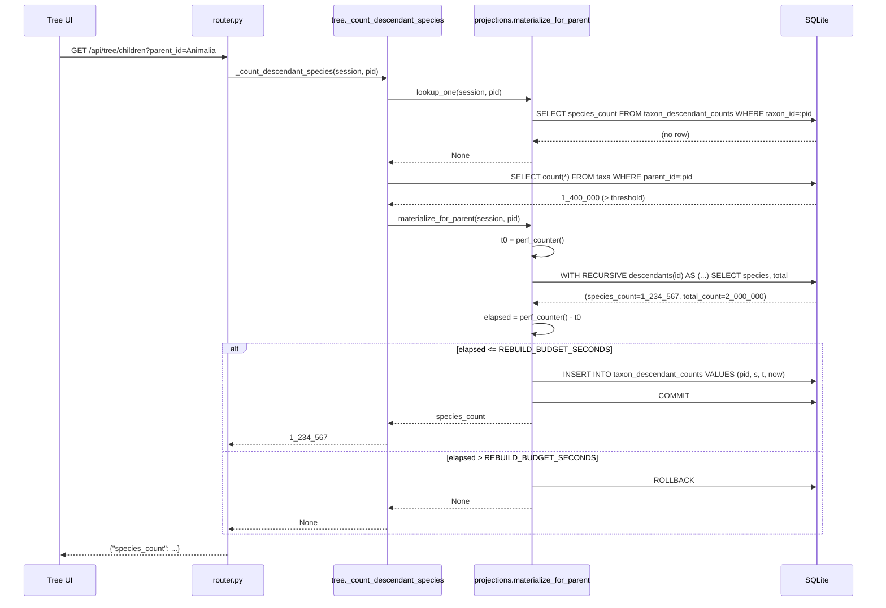

# Design: descendant-counts-projection

## Technical Approach

Add a persistent `taxon_descendant_counts` table that caches
`(species_count, total_count)` for exactly the parents whose
`direct_children_count` exceeds `SPECIES_COUNT_LAZY_NULL_THRESHOLD`
(`taxon/api/tree.py:70`, 1M). Today those parents short-circuit to
`None` at `taxon/api/tree.py:198-201` (direct-count guard) and
`taxon/api/tree.py:236-239` (total-count guard), so `Animalia`,
`Eukaryota`, and `Methanobacteriota` render `?` forever.

The shape of the change is one backend slice: an ORM class in
`taxon/schema.py`, a new `taxon/api/projections.py` module owning both
the rebuild worker and the read helpers, two call-site edits in the
read path (`_count_descendant_species`, `_batch_species_counts`), a
`migrate` subcommand, and an `import_data` post-hook. The read path
gains a cache pre-check; on a miss it runs the same recursive CTE it
runs today, times the walk, and either commits the row or rolls back
to the existing lazy-null behaviour. Everything stays on the
synchronous `Session` the current helpers already take — no threads,
no async, no background worker.

The module is named `projections.py` rather than the proposal's
`_projection.py`: it carries a public CLI-facing and import-facing
surface (`materialize_all` is called by `taxon/migrate.py` and
`taxon/import_data.py`, both outside `taxon/api/`), so the
underscore-private convention used for `_tree_tiers.py` does not fit.
This is ADR-1.

## Architecture Decisions

| Decision | Choice | Tradeoff | Decision rationale |
| --- | --- | --- | --- |
| Module name and location | `taxon/api/projections.py` (public, no leading underscore) | Breaks with the `_tree_tiers.py` / `_projection.py` naming in the proposal | `materialize_all` is imported by `taxon/migrate.py` and `taxon/import_data.py`, which sit outside `taxon/api/`. A leading underscore signals package-private; this surface is not. See ADR-1. |
| ORM class location | `TaxonDescendantCount` in `taxon/schema.py` next to `Taxon` (`taxon/schema.py:20`) and `SpeciesPath` (`taxon/schema.py:41`) | `taxon/api/workspace.py` also declares models on the same `Base` | The projection is a taxonomy-derived table, not a workspace table. `workspace.py` models are `(genus, epithet)`-keyed and survive re-imports by design (`taxon/api/workspace.py:18-21`); this table is FK'd to `taxa.id` and is invalidated by a re-import. It belongs with `SpeciesPath`, which has the same lifecycle. |
| Table lifecycle | `Base.metadata.create_all` (no Alembic), same as `SpeciesPath` | `migrate.py:_run_apply` filters to `WORKSPACE_TABLES` (`taxon/migrate.py:236-243`), so the table is NOT created by plain `apply` unless we widen that tuple | Widen the filter with a new `PROJECTION_TABLES` tuple rather than pushing the name into `WORKSPACE_TABLES` — the docstring at `taxon/api/workspace.py:43-50` pins that tuple's meaning, and `test_apply_creates_three_new_tables` asserts on its size. See "Migration / Rollout". |
| Threading model | Synchronous, on the caller's `Session` | First request for a cold parent pays the rebuild latency inline | Every current helper takes `Session` (`taxon/api/tree.py:156`, `taxon/api/_tree_tiers.py:407`). Introducing a thread or task queue would need a second engine, a second `taxonomy_display_level` registration, and lifespan wiring. The SLO guard below makes the inline cost bounded. |
| SLO measurement | Measure elapsed wall-clock with `time.perf_counter()` **around the already-issued CTE**, then decide to commit or roll back | We pay the full CTE cost even when we then discard the result | We cannot predict the cost without walking. But the walk is the same walk the pre-change code was willing to run for sub-threshold parents, and the discard path returns exactly the pre-change answer (`None`). Measuring after is honest; predicting before is a guess. See ADR-2. |
| Cache-hit precedence | Cached row wins over both threshold guards and over any CTE value | A stale row can outlive a `taxa` mutation that did not go through `import_data` | Pinned by the spec (`Cached stale row wins over CTE`). `computed_at` makes the staleness observable and `apply-projection` is the documented repair. |
| Batch merge strategy | Pre-load cached rows with one `IN`-list `SELECT`, remove those ids from the seed list, leave the existing single CTE untouched | One extra round trip per batch | Keeps the existing single-CTE contract intact — the CTE's seed-union shape at `taxon/api/_tree_tiers.py:467` is unchanged, it just receives a shorter `eligible` list. No SQL rewrite, no new join. |

### ADR-1: `projections.py` owns both the worker and the read helpers

**Choice**: one module, `taxon/api/projections.py`, exports
`materialize_for_parent`, `materialize_all`, `lookup_one`, and
`lookup_many`.

**Alternatives considered**: (a) split reads into `taxon/api/tree.py`
and writes into a `taxon/projection_worker.py`; (b) put everything on
the ORM class as classmethods.

**Rationale**: the read helpers and the write worker share the
population predicate (`direct_children_count > threshold`) and the
threshold constant import. Splitting them puts that predicate in two
files and re-opens the drift risk the spec explicitly names. Option
(b) puts SQL-text CTEs on a declarative model, which no other model in
`taxon/schema.py` does.

### ADR-2: the SLO budget is measured, not predicted

**Choice**: `materialize_for_parent` runs the CTE, measures elapsed
time with `time.perf_counter()`, and commits only when
`elapsed <= REBUILD_BUDGET_SECONDS`. Over budget → `session.rollback()`
and return without writing.

**Alternatives considered**: (a) predict the cost from
`direct_children_count` before walking; (b) use a SQLite
`progress_handler` / statement interrupt to abort the CTE mid-walk;
(c) no budget at all.

**Rationale**: (a) is exactly the heuristic that already failed —
`taxon/api/tree.py:58-66` documents that `Eukaryota` has 9 direct
children and a 5.6M-row subtree, so fan-out does not predict cost.
(b) requires a connection-level handler that would fire inside
unrelated queries on the shared SQLite connection and can leave the
session in a half-aborted state. (c) violates the spec's SLO
requirement. Measuring after the walk means the *first* request for an
over-budget parent still pays the full cost once — but it returns the
pre-change answer (`None`), and because we skip the write, the next
request retries. That retry behaviour is exactly what the spec's
`Rebuild over budget skips the write` scenario pins.

## Data Flow

```
    Router                _count_descendant_species        projections.py            SQLite
    ------                -------------------------        --------------            ------
  GET /api/tree/children ─► _cache hit? ──yes──► return
                            │ no
                            ▼
                            lookup_one(session, pid) ────►  SELECT species_count
                            │                               FROM taxon_descendant_counts
                            │◄──────── hit ─────────────────  WHERE taxon_id = :pid
                            │                                        │
                            │  (hit) return species_count ───────────┘  [no threshold guard, no CTE]
                            ▼ (miss)
                            direct_count > threshold? ──no──► existing CTE path (unchanged)
                            │ yes
                            ▼
                            materialize_for_parent ──────►  perf_counter() start
                                                            recursive CTE (species + total)
                                                            perf_counter() end
                                                            ├─ under budget → INSERT row, commit
                                                            └─ over budget  → rollback, no row
                            │
                            ▼
                            return species_count | None
```

### First-read sequence (cold cache, under budget)



## File Changes

| File | Action | Description |
| --- | --- | --- |
| `taxon/schema.py` | Modify | Add `TaxonDescendantCount(Base)` after `SpeciesPath` (`taxon/schema.py:41-56`). Four columns, `taxon_id` PK + FK to `taxa.id`. ~18 LOC. |
| `taxon/api/projections.py` | Create | New module. `REBUILD_BUDGET_SECONDS`, `PROJECTION_TABLES`, `materialize_for_parent`, `materialize_all`, `lookup_one`, `lookup_many`, `_projected_parent_ids`, `_table_exists`. ~180 LOC. |
| `taxon/api/tree.py` | Modify | `_count_descendant_species` (`taxon/api/tree.py:155-242`): insert `lookup_one` before the direct-count guard at line 196; on the threshold branch at lines 198-201 and the total-count branch at lines 236-239, call `materialize_for_parent`. ~25 LOC net. |
| `taxon/api/_tree_tiers.py` | Modify | `_batch_species_counts` (`taxon/api/_tree_tiers.py:406-488`): insert `lookup_many` after the `direct_counts` read at line 446; seed the `result` dict with cached values and exclude those ids from `eligible` (lines 448-455). The CTE at lines 467-485 is untouched. ~15 LOC net. |
| `taxon/migrate.py` | Modify | Add `apply-projection` subparser with `--threshold`; add `PROJECTION_TABLES` to the `_run_apply` table set so plain `apply` creates the table; register `taxonomy_display_level` on the CLI engine (`taxon/migrate.py:233`). ~45 LOC. |
| `taxon/import_data.py` | Modify | Call `materialize_all` after `_populate_species_paths(engine)` (`taxon/import_data.py:71`), before the `return counts`. The engine at `taxon/import_data.py:75-84` already has a `connect` listener — add the `taxonomy_display_level` registration there. ~15 LOC. |
| `taxon/tests/test_descendant_counts_projection.py` | Create | RED-first tests for schema, cache hit/miss, SLO fallback, idempotency, batch merge, legacy DB. 14 tests, ~380 LOC. |
| `taxon/tests/test_migrate.py` | Modify | Add `apply-projection` CLI tests; update `test_apply_creates_three_new_tables` for the widened table set. ~60 LOC. |
| `openspec/changes/descendant-counts-projection/design.md` | Create | This document. |
| `documents-es/openspec/descendant-counts-projection/design-es.md` | Create | Spanish mirror (faithful translation, neutral/professional) per AGENTS.md §1. |

## Interfaces / Contracts

### DDL

```sql
CREATE TABLE taxon_descendant_counts (
    taxon_id      INTEGER  NOT NULL PRIMARY KEY REFERENCES taxa (id),
    species_count INTEGER  NOT NULL,
    total_count   INTEGER  NOT NULL,
    computed_at   VARCHAR  NOT NULL
);
```

No secondary index: `taxon_id` is the PRIMARY KEY, which SQLite backs
with the rowid B-tree, and every access path is either a point lookup
by PK or an `IN`-list over PKs. The population is bounded by the
number of threshold-exceeding parents (3 on the current CoL dataset).

`computed_at` is stored as an ISO-8601 string, matching the
`SpeciesExplored.explored_at` convention at
`taxon/api/workspace.py:67-71` (`String` + `datetime.now(UTC).isoformat(timespec="seconds")`),
not a native `TIMESTAMP` — SQLite has no timestamp type and the rest
of the codebase already normalised on ISO strings.

### ORM class — `taxon/schema.py`

```python
class TaxonDescendantCount(Base):
    """Cached (species_count, total_count) for a threshold-exceeding parent.

    Unlike the workspace tables in :mod:`taxon.api.workspace`, this row
    is keyed by ``taxa.id`` and is therefore invalidated by a re-import;
    :func:`taxon.api.projections.materialize_all` rebuilds it as the last
    step of ``taxon.import_data``.
    """

    __tablename__ = "taxon_descendant_counts"

    taxon_id: Mapped[int] = mapped_column(ForeignKey("taxa.id"), primary_key=True)
    species_count: Mapped[int] = mapped_column(Integer, nullable=False)
    total_count: Mapped[int] = mapped_column(Integer, nullable=False)
    computed_at: Mapped[str] = mapped_column(
        String,
        nullable=False,
        default=lambda: datetime.now(UTC).isoformat(timespec="seconds"),
    )
```

### Module surface — `taxon/api/projections.py`

```python
from taxon.api.tree import SPECIES_COUNT_LAZY_NULL_THRESHOLD, SPECIES_DISPLAY_LEVEL

PROJECTION_TABLES: tuple[str, ...] = ("taxon_descendant_counts",)

REBUILD_BUDGET_SECONDS: Final[float] = 1.0
"""Per-request rebuild budget. Matches the 1s /api/tree/children SLO
documented at taxon/api/tree.py:67-69."""


def lookup_one(session: Session, taxon_id: int) -> int | None:
    """Return the cached ``species_count`` or ``None`` on a miss.

    Returns ``None`` both when the row is absent AND when the table
    itself is absent (legacy DB) — the caller cannot distinguish, and
    does not need to: both fall through to the pre-change path.
    """


def lookup_many(session: Session, taxon_ids: list[int]) -> dict[int, int]:
    """Return ``{taxon_id: species_count}`` for the cached subset.

    Absent ids are simply missing from the dict. One ``IN``-list
    SELECT; empty input returns ``{}`` without a round trip.
    """


def materialize_for_parent(
    session: Session,
    parent_id: int,
    *,
    budget_seconds: float = REBUILD_BUDGET_SECONDS,
) -> int | None:
    """Rebuild and persist the row for ``parent_id``; return species_count.

    Runs the same recursive CTE as
    :func:`taxon.api.tree._count_descendant_species`, measures the
    elapsed wall-clock, and commits the row only when the walk finished
    within ``budget_seconds``. Over budget → ``session.rollback()`` and
    ``None`` (the pre-change answer), no row written.

    Idempotent: an existing row is overwritten in place (upsert on the
    primary key), so re-running never duplicates or accumulates rows.
    """


def materialize_all(
    session: Session,
    threshold: int = SPECIES_COUNT_LAZY_NULL_THRESHOLD,
    *,
    budget_seconds: float | None = None,
) -> int:
    """Rebuild every threshold-exceeding parent; return rows written.

    Iterates :func:`_projected_parent_ids` and calls
    :func:`materialize_for_parent` per parent. ``budget_seconds=None``
    (the default for the offline callers — ``migrate apply-projection``
    and ``import_data``) disables the SLO guard: those callers are not
    serving a request and MUST complete the population.
    """


def _projected_parent_ids(session: Session, threshold: int) -> list[int]:
    """Return ids whose direct-children count exceeds ``threshold``.

    ``SELECT parent_id FROM taxa WHERE parent_id IS NOT NULL
       GROUP BY parent_id HAVING count(*) > :threshold``
    """
```

The `budget_seconds=None` escape on `materialize_all` is the one
asymmetry worth calling out: the request path must respect the SLO,
but `apply-projection` and `import_data` are offline batch callers and
would otherwise refuse to populate exactly the parents the table
exists for. The spec's SLO requirement is scoped to "the tree
endpoint meets its per-request SLO"; it does not constrain the CLI.

### Read-path integration — `taxon/api/tree.py`

`_count_descendant_species` (`taxon/api/tree.py:155`) gains a cache
pre-check and two rebuild hooks. The `_cache` request-scoped dict at
lines 189-190 stays the first check (it is cheaper than a query) and
the cached-row lookup slots in immediately after:

```python
    if _cache is not None and parent_id in _cache:      # line 189, unchanged
        return _cache[parent_id]

    cached = lookup_one(session, parent_id)             # NEW
    if cached is not None:
        if _cache is not None:
            _cache[parent_id] = cached
        return cached                                   # no threshold guard, no CTE

    direct_count = ...                                  # line 196-197, unchanged
    if direct_count > threshold:                        # line 198
        rebuilt = materialize_for_parent(session, parent_id)   # NEW
        if _cache is not None:
            _cache[parent_id] = rebuilt
        return rebuilt                                  # None when over budget
```

The second guard at lines 236-239 (`total_count > threshold`) takes
the same treatment, except the CTE has *already run* at that point —
so instead of calling `materialize_for_parent` (which would re-walk),
it writes the `(species_count, total_count)` it already holds through
a `_persist` helper, subject to the same budget check on the elapsed
time of that walk.

### Batch integration — `taxon/api/_tree_tiers.py`

`_batch_species_counts` keeps its single-CTE contract. The only change
is that `eligible` gets shorter:

```python
    direct_counts = {...}                               # line 444-446, unchanged

    cached = lookup_many(session, parent_ids)           # NEW — one IN-list SELECT

    result: dict[int, int | None] = {}
    eligible: list[int] = []
    for pid in parent_ids:                              # line 450
        if pid in cached:                               # NEW — cache wins
            result[pid] = cached[pid]
            continue                                    # excluded from the CTE seed
        if direct_counts.get(pid, 0) > threshold:
            result[pid] = None
        else:
            eligible.append(pid)
            result[pid] = None
```

The seed union at line 467 (`SELECT {pid} AS root_id, {pid} AS id`) is
built from `eligible`, so a cached parent contributes no seed row and
the CTE never walks it. The `if not eligible: return result` guard at
lines 457-458 already handles the all-cached case correctly. The
aggregation loop at lines 486-487 writes only into ids that were
seeded, so it cannot overwrite a cached value — which is precisely the
`Cached stale row wins over CTE` scenario, satisfied structurally
rather than by an ordering convention.

Note the pre-existing threshold asymmetry: `_batch_species_counts`
defaults to `threshold: int = 100_000` (`taxon/api/_tree_tiers.py:410`)
while `_count_descendant_species` defaults to
`SPECIES_COUNT_LAZY_NULL_THRESHOLD` = 1_000_000
(`taxon/api/tree.py:159`). This design does **not** change that
default — a threshold change is out of scope per the spec — but
`lookup_many` runs before either guard, so a parent with a cached row
resolves identically on both paths regardless of which default fired.
The population predicate in `_projected_parent_ids` reads
`SPECIES_COUNT_LAZY_NULL_THRESHOLD` only, which is the single source
of truth the spec requires.

## The `taxonomy_display_level` Registration Gap

The recursive CTE calls the SQLite user function
`taxonomy_display_level` (`taxon/api/tree.py:221`,
`taxon/api/_tree_tiers.py:479`). That function is registered on a
`connect` event listener that exists **only** in the FastAPI engine
factory (`taxon/api/__init__.py:92-95`).

Both new offline callers build bare engines that lack it:

- `taxon/migrate.py:233` — `create_engine(database_url)`, no listener.
- `taxon/import_data.py:76` — has a `connect` listener
  (`taxon/import_data.py:78-82`) but it only sets `PRAGMA foreign_keys=ON`.

Running `materialize_all` from either without fixing this raises
`sqlite3.OperationalError: no such function: taxonomy_display_level`.

**Resolution**: extract the registration into a shared helper and call
it from all three engine builders.

```python
# taxon/api/projections.py
def register_display_level(engine: Engine) -> None:
    """Attach ``taxonomy_display_level`` to every new SQLite connection.

    Mirrors the FastAPI factory's listener at taxon/api/__init__.py:92-95
    so the offline callers (migrate, import_data) can run the same
    recursive CTE the request path runs.
    """
```

`taxon/api/__init__.py:_build_engine` is left alone (it already works);
the helper is called from `taxon/migrate.py` after line 233 and from
`taxon/import_data.py:_sqlite_engine` before the return at line 84.
This is a discovery the spec did not anticipate and is the single
highest-risk integration point in the change — it is invisible to unit
tests that use the API's engine and only surfaces when the CLI runs.
`test_apply_projection_runs_the_cte_on_a_bare_engine` exists
specifically to catch it.

## Testing Strategy

| Layer | What to test | Approach |
| --- | --- | --- |
| Unit — schema | Table + four columns exist after `create_all`; PK on `taxon_id`; pre-existing `taxa` / `species_paths` untouched | `sqlalchemy.inspect` on a `tmp_path` SQLite file |
| Unit — read path | Cache hit returns without CTE; miss falls through; rebuild writes the row | Monkeypatch `session.execute` counter, or assert on `sqlalchemy` event-logged statements |
| Unit — SLO | Under budget commits; over budget rolls back and returns `None` | Inject `budget_seconds=0.0` to force the over-budget branch deterministically — no sleeps, no flaky timing |
| Unit — batch merge | Mixed batch (1 cached + 3 sub-threshold) returns cached + CTE values; cached parent absent from the CTE seed | Assert on the generated seed SQL text and on the result dict |
| Unit — idempotency | Second `materialize_all` leaves row count and values unchanged | Call twice, snapshot the table between runs |
| Integration — CLI | `apply` creates the table; `apply-projection` populates and is idempotent; `--threshold` narrows the population | `subprocess` against a `tmp_path` DB, matching the existing `taxon/tests/test_migrate.py` harness |
| Integration — import | `import_data` leaves the table fresh; `computed_at` later than import start | Small fixture dataset through `import_dataset` |
| Regression | `taxon/tests/test_species_count_lazy_null.py` stays green unchanged | Run as-is; no edits permitted to that file |

### RED-first test inventory — `taxon/tests/test_descendant_counts_projection.py`

Strict TDD: each of the following is written failing before the
corresponding implementation lands.

| # | Test | Pins |
| --- | --- | --- |
| 1 | `test_apply_creates_taxon_descendant_counts_table` | Schema requirement, fresh-DB scenario |
| 2 | `test_apply_preserves_pre_existing_taxa_rows` | Schema requirement, existing-rows scenario |
| 3 | `test_lookup_one_returns_none_when_table_absent` | Legacy-DB requirement |
| 4 | `test_cache_hit_returns_without_running_cte` | First-read requirement, cache-hit scenario |
| 5 | `test_cache_hit_skips_threshold_guard` | Delta: cache hit short-circuits the threshold branch |
| 6 | `test_first_read_materializes_row_and_sets_computed_at` | First-read requirement, materialisation scenario |
| 7 | `test_cache_miss_below_threshold_uses_existing_cte_path` | Delta: miss falls through unchanged |
| 8 | `test_rebuild_over_budget_skips_write_and_returns_none` | SLO requirement, over-budget scenario (`budget_seconds=0.0`) |
| 9 | `test_rebuild_under_budget_writes_row` | SLO requirement, under-budget scenario |
| 10 | `test_batch_merges_cached_and_cte_counts` | Batch requirement, mixed-batch scenario |
| 11 | `test_batch_excludes_cached_ids_from_cte_seed` | Batch requirement, "CTE not invoked for cached parent" |
| 12 | `test_materialize_all_populates_only_above_threshold_parents` | Population rule, both scenarios |
| 13 | `test_materialize_all_is_idempotent` | `apply-projection` + `import_data` idempotency scenarios |
| 14 | `test_apply_projection_runs_the_cte_on_a_bare_engine` | The `taxonomy_display_level` gap above |

Additions to `taxon/tests/test_migrate.py`:
`test_apply_projection_exits_zero_on_empty_db`,
`test_apply_projection_respects_threshold_flag`,
`test_apply_projection_is_idempotent_via_cli`.

## Threat Matrix

N/A — no routing, shell, subprocess, VCS/PR automation,
executable-file classification, or process-integration boundary. The
change adds one SQLite table, one internal module, and one
`argparse` subparser to an existing CLI (`taxon/migrate.py:208-229`).
The new `--threshold` argument is `type=int` and is bound as a named
SQL parameter, never interpolated into SQL text. No new public
endpoint, no new network surface, no file-mode changes.

## Migration / Rollout

- **Table creation via `apply`.** `_run_apply` (`taxon/migrate.py:158`)
  filters `create_all` to the `table_names` tuple it receives, which
  `main` passes as `WORKSPACE_TABLES` (`taxon/migrate.py:240`). The
  spec requires `apply` to create the projection table, so `main`
  passes `WORKSPACE_TABLES + PROJECTION_TABLES`. `WORKSPACE_TABLES`
  itself is **not** widened — its docstring
  (`taxon/api/workspace.py:43-50`) pins it to the three
  re-import-surviving workspace tables, and
  `test_apply_creates_three_new_tables` asserts on that meaning.
- **Legacy DBs.** `lookup_one` / `lookup_many` catch
  `OperationalError: no such table` and return the empty result, so a
  `taxon.db` without the table behaves exactly as pre-change. The
  spec's legacy scenarios are satisfied without a version check.
- **Post-import freshness.** `materialize_all` runs after
  `_populate_species_paths` (`taxon/import_data.py:71`). Note that
  `import_dataset` calls `Base.metadata.drop_all` at line 46, so the
  projection table is dropped and recreated with the rest of the
  schema on every import — there is no stale-row window.
- **Manual repair.** `python -m taxon.migrate apply-projection`
  re-runs the population against the current `taxa` contents. Safe on
  a populated table (upsert on PK), safe on an empty one, exits zero
  either way.
- **Rollback.** Purely additive. `git revert <merge-commit>` plus
  `DROP TABLE taxon_descendant_counts;` returns the read path to
  lazy-null. No data loss: every value in the table is derivable from
  `taxa`.

## Risks Carried From the Spec

| Spec risk | Resolution in this design |
| --- | --- |
| Threshold constant must be a single source of truth | `_projected_parent_ids` and the read path both import `SPECIES_COUNT_LAZY_NULL_THRESHOLD` from `taxon/api/tree.py:70`. `projections.py` declares no threshold of its own. The pre-existing `100_000` default on `_batch_species_counts` (`taxon/api/_tree_tiers.py:410`) is left untouched — out of scope — and is made irrelevant for cached parents because `lookup_many` runs before it. |
| Legacy "Out of Scope" line in `taxonomic-tree-browse` | **Pruned.** The line `species_count materialization at deep nodes` is removed from `openspec/specs/taxonomic-tree-browse/spec.md`'s Out of Scope section as part of the apply phase; the delta spec already records it as superseded. Tracked as a task so it is not forgotten at archive time. |
| `_batch_species_counts` query shape must not break | The CTE text (`taxon/api/_tree_tiers.py:467-485`) is byte-identical after the change. Only the Python-side `eligible` list shortens. Test #11 asserts the cached id is absent from the generated seed union. |

## Open Questions

None blocking. One deferred observation: `_batch_species_counts`
carries a `threshold=100_000` default that disagrees with
`SPECIES_COUNT_LAZY_NULL_THRESHOLD=1_000_000`. Reconciling them is a
behaviour change to the tier path and is explicitly out of scope here;
it is worth a follow-up proposal after this change lands.
